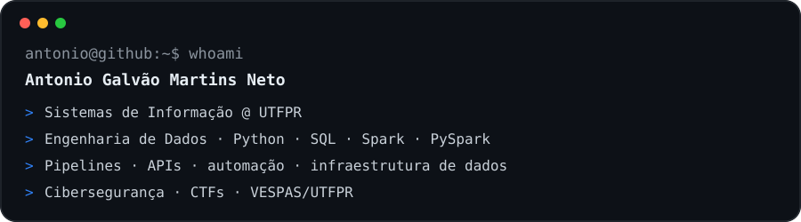

  

### Sobre mim

Sou estudante de **Sistemas de Informação na UTFPR** e atuo principalmente com **Engenharia de Dados**, trabalhando com processamento, transformação, integração e investigação de dados.

Tenho experiência com **Python, SQL, PySpark, Apache Spark, APIs, pipelines, automações e infraestrutura de dados**, além de interesse e atuação em **cibersegurança, sistemas distribuídos e inteligência artificial**.

Também faço parte do **VESPAS/UTFPR**, projeto voltado a cibersegurança, CTFs, educação e produção de conteúdo técnico.

### Principais tecnologias

### Dados & infraestrutura

  
  
  
  
  
  
  

### Projetos em destaque

**[Driva Sentinel](https://github.com/anetogm/driva-sentinel)**  
Plataforma de análise de segurança para aplicações web, com scanners especializados, pontuação de risco, API REST e infraestrutura preparada para Kubernetes.

**[Feedback Inteligente](https://github.com/anetogm/feedback-inteligente)**  
Chatbot com IA, function calling, integrações externas, histórico persistente e vector store.

**[Sistema de Leilões com gRPC](https://github.com/anetogm/grpc)**  
Aplicação distribuída baseada em microsserviços, Protocol Buffers, streaming e gateway central.

**[Linux Process Dashboard](https://github.com/anetogm/Dashboard-SO)**  
Dashboard de monitoramento em tempo real para Linux, lendo diretamente de `/proc` para acompanhar processos, CPU e memória.

### Cibersegurança

Além de Engenharia de Dados, mantenho atuação contínua em **cibersegurança**, especialmente em **CTFs, segurança web, forense digital, redes e automação de segurança** por meio do VESPAS/UTFPR e de projetos próprios.

### Atualmente

> [!IMPORTANT]
> Meu foco profissional está em **Engenharia de Dados**, com interesse especial em pipelines, qualidade de dados, sistemas distribuídos, automação e infraestrutura. Cibersegurança continua sendo uma das principais áreas que desenvolvo em paralelo.

### GitHub

  

